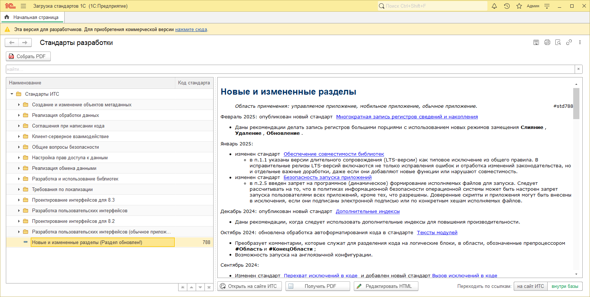
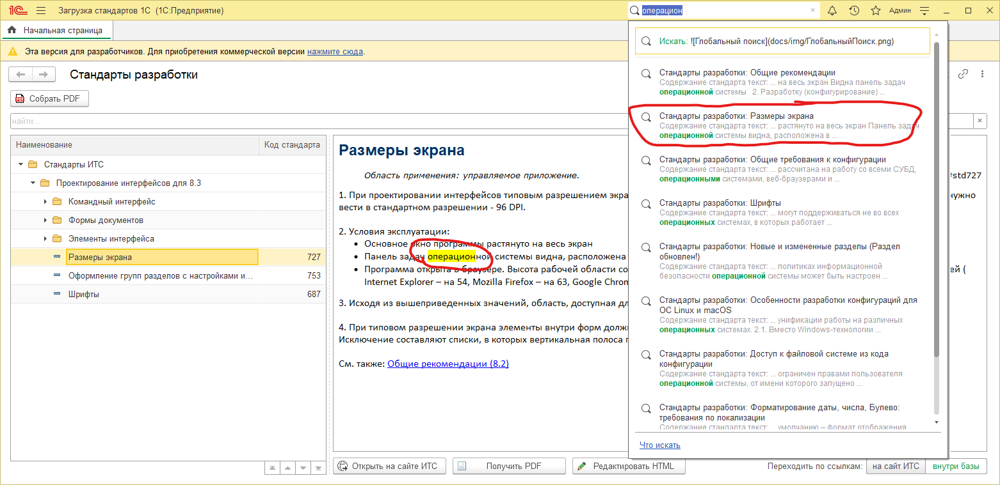
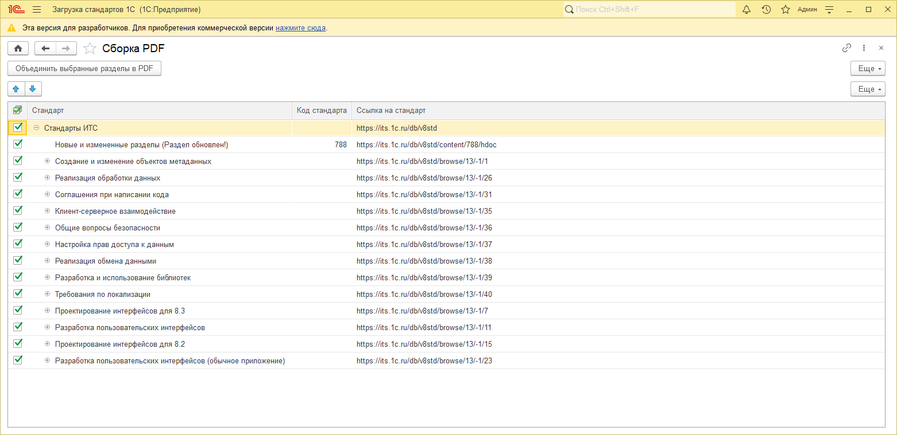
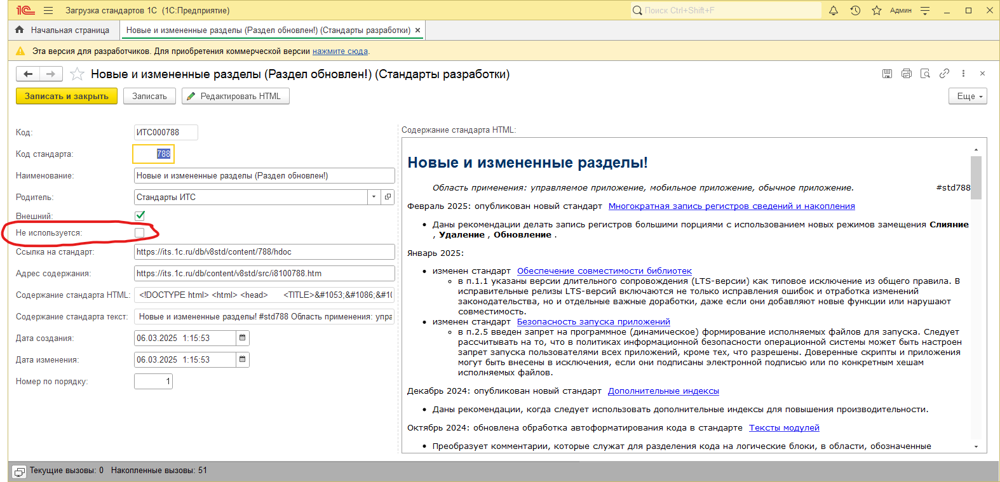

# Загрузка, редактирование и сохранение в PDF стандартов 1С

## Описание
Конфигурация, которая позволяет загружать [стандарты разработки фирмы 1С](https://its.1c.ru/db/v8std) в справочник, отображать каждый из стандартов в виде HTML-документа, при необходимости - редактировать его содержимое встроенным wysiwyg-редактором HTML, а так же сохранять их виде PDF-документа, управляя составом стандартов в нём.
Разработка вдохновлена обработкой [Загрузка стандартов с ИТС](https://infostart.ru/1c/tools/2202706).

## Внешний вид

Ссылки внутри текстов стандартов могут вести как на сайт ИТС, так и на элементы справочника, позволяя оставаться внутри базы (и даже одной формы). Переход "Назад", как в браузере, пока не реализован.

Можно получить просматриваемый стадарт сразу в PDF, открыть его на сайте ИТС или отредактировать (если есть право) встроенным wysiwyg HTML-редактором.

Можно искать по текстам стандартов с помощью простого поля, накладывающего отбор "Содержит" на содержание стандартов.

Можно искать по текстам стандартов с помощью глобального поиска, переходя к нужному стандарту в дереве стандартов, оставаясь так же в рамках одной формы. 

При поиске в тексте стандарта подсвечивается искомая строка поиска, однако в случае использования специальных операторов при глобальном поиске подстветки не будет, т.к. она основана на примитивном сравнении строк.

## Роли
Помимо роли **ПолныеПрава**, позволяющей загружать стандарты и редактировать их текст, есть роль **ТолькоПросмотр** (сохранение в PDF в этом случае так же доступно).

## Сборка единого PDF-файла
Конфигурация даёт возможность собрать все нужные стандарты в один файл PDF

Если какой-то стандарт не нужно исключить из сборки, в его карточке нужно поставить галочку **Не используется**

## Технические детали

### Версия платформы
Разработка велась в конфигураторе, на платформе 8.3.27.1508

### Конвертация в PDF
Формирование PDF реализовано с помощью [wkhtmltopdf](https://infostart.ru/1c/tools/2202706) **0.12.6-1 Windows x64**. Утилита встроена в конфигурацию, но можно в константе **Путь к wkhtmltopdf.exe** указать путь до уже установленной в системе.

### HTML-редактор
Использование wysiwyg HTML-редактора [SunEditor](http://suneditor.com/sample/index.html) взято из разработки [HTML редактор/editor (Wysiwyg) для WebKit 1С (CMS, B2B), альтернатива TinyMCE и стандартному ФорматированныйДокумент](https://infostart.ru/1c/articles/1352459). Используется latest-версия (на текущий момент) редактора **2.47.5**. Все файлы редактора так же встроены в конфигурацию и перед использованием они распаковываются во временную папку, либо можно в константе **Путь к HTML-редактору** указать путь до уже установленного в системе редактора.
Так же можно указать путь до опубликованного на веб-сервере редактора, тогда, в теории, редактор можно будет использовать в веб-клиенте и в мобильном клиенте, но работу в мобильном клиенте я не проверял, а в веб-клиенте пока не получается использовать, появляется ошибка [Cannot read properties of null (reading 'style')](https://github.com/JiHong88/SunEditor/issues/1052).